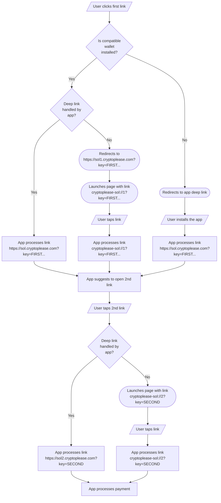
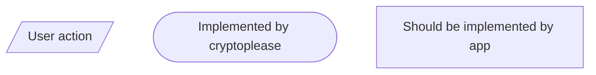

# Crypto Please Protocol

## Pre-requisites

1. Wallet applies for registration and provides deep link for app installation. For example, if wallet uses Firebase Deep Links, it will have the following format: `https://example.page.link/?link={{ link }}&apn=com.example.app&ibi=com.example.app&isi=1234567890`. `{{ link }}` is a stub and will be later replaced automatically.
2. We add wallet to the DB and assign `appId`.
3. We add wallet IDs to `assetlinks.json` and `apple-app-site-association`.
4. Wallet can generate both links offline. The first one has the following format: `https://sol.cryptoplease.link?key=KEY_FIRST_PART&token=TOKEN_ID&app=APP_ID`
   
   | Parameter | Required | Description |
   |-----------|----------|-------------|
   | key       | Yes      | First part of base58-encoded private key. |
   | token     | No       | Token mint. If not provided, SOL will be used. |
   | app       | No       | App ID to install if user has no other compatible wallet installed. CryptoPlease app will be used if not provided at all or invalid ID is provided. |

   The second link has the following format: `https://sol2.cryptoplease.link?key=KEY_SECOND_PART`

   | Parameter | Required | Description |
   |-----------|----------|-------------|
   | key       | Yes      | Second part of base58-encoded private key. |

5. User can send the links using any method.

## Processing flow

### Legend:

